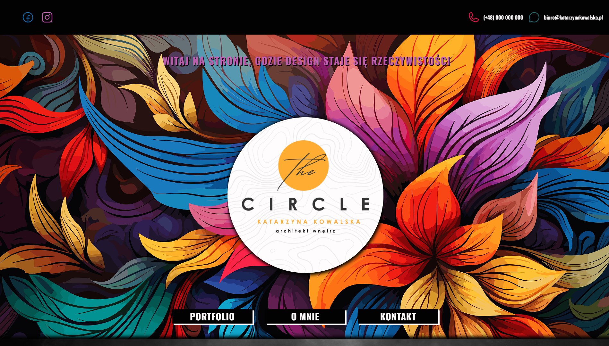
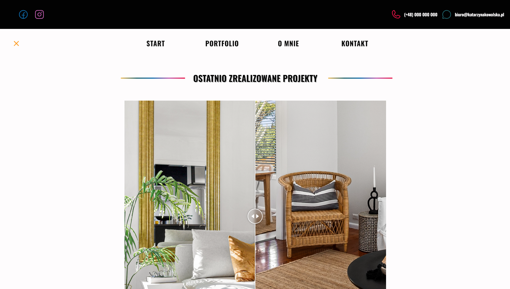

# Interior Designer Portfolio 🪴

This repository hosts the source code for a comprehensive portfolio exemplifying the work of an individual specializing in interior design. Through a collection of meticulously curated projects, this portfolio not only showcases an impressive array of skills but also provides a captivating insight into the creative journey within the realm of interior design.

From conceptualization to execution, each project narrates a unique story, reflecting the seamless amalgamation of aesthetics, functionality, and innovation.

The project is available at the email address: `https://interior-designer-website.onrender.com/`

## Features

-   Presentation of interior design projects,
-   Information about me and skills,
-   Contact details,
-   Previous works.

## Installation and Local Setup

1. Clone this repository: `git clone https://github.com/JoannaPatyk/interior-designer.git`
2. Navigate to the project directory: `cd interior-designer`
3. Install dependencies: `npm install`
4. Run the project locally: `npm start`

Open [http://localhost:3000](http://localhost:3000) to view it in your browser.

## Technologies

-   HTML,
-   CSS,
-   JavaScript,
-   React,
-   React Router.

## Getting Started with Create React App

This project was bootstrapped with [Create React App](https://github.com/facebook/create-react-app).
